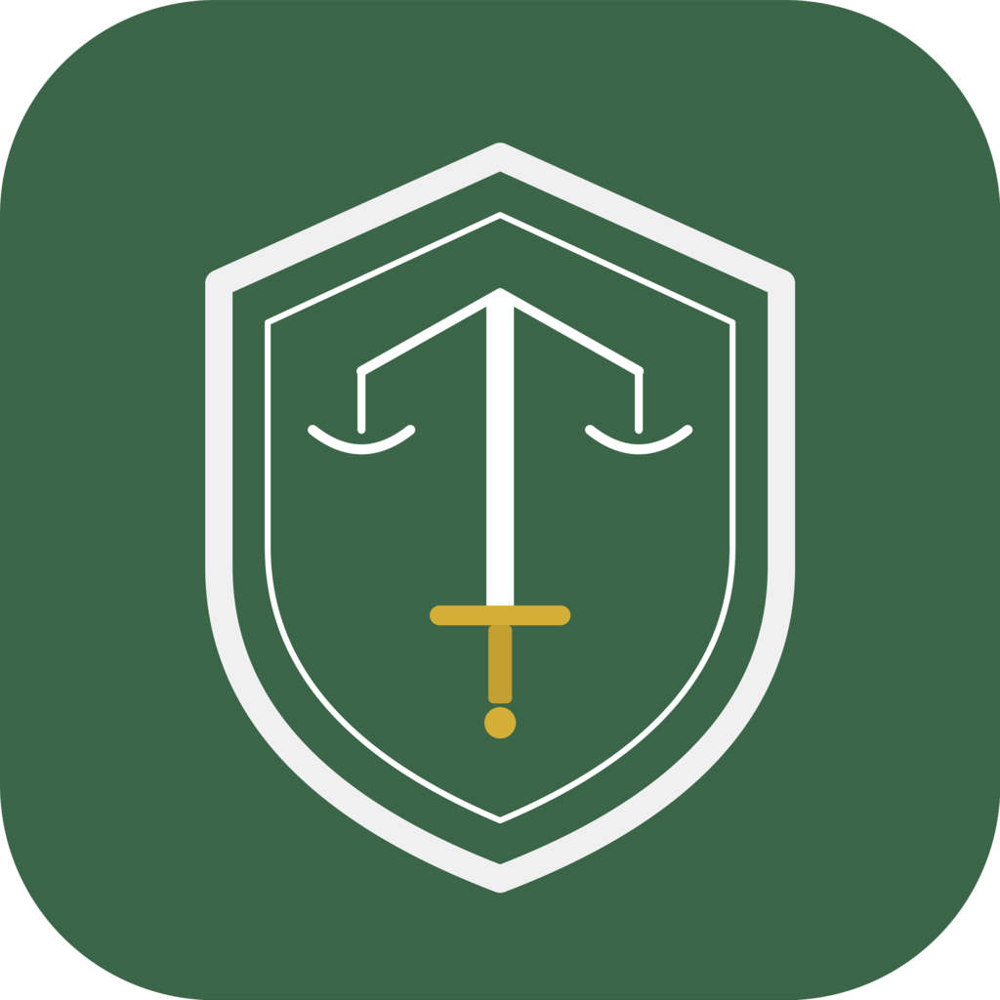

<p align="center">
  
</p>

<h1 align="center">Mithril Cowork</h1>

<p align="center">
  <strong>AI-powered legal workspace for modern law practice</strong>
</p>

<p align="center">
  
  &nbsp;
  
  &nbsp;
  
</p>

<p align="center">
  <a href="https://github.com/jonathankleiman/mithril-cowork/releases">
    
  </a>
  &nbsp;&nbsp;
  <a href="https://mithril.law" target="_blank">
    
  </a>
</p>

---

## What is Mithril Cowork?

Mithril Cowork is a desktop AI workspace built for legal professionals. It combines the power of modern AI models with tools designed specifically for law practice — limitation period calculations, court form filling, legal citation formatting, conflict checks, and more.

Built on the open-source [AionUI](https://github.com/iOfficeAI/AionUi) platform and extended with a purpose-built legal automation layer.

**Key capabilities:**

- 🛡️ **6 Legal AI Assistants** — specialized for drafting, research, court forms, intake, and deadline tracking
- ⚖️ **10 Legal Skills** — demand letters, retainer agreements, case briefs, costs outlines, and more
- 🔧 **Built-in Legal MCP Server** — Ontario limitation periods, filing fees, citation formatting, conflict checks, jurisdiction analysis, service deadline calculation
- 🤖 **Multi-Agent Support** — use Ollama (local), Claude, GPT, Gemini, DeepSeek, or bring your own
- 🖥️ **Cross-Platform** — macOS, Windows, and Linux
- 📁 **Local-First** — all data stays on your machine in a local SQLite database

---

## Legal Assistants

Mithril Cowork ships with 6 purpose-built legal assistants, each with tailored system prompts and enabled skills:

| Assistant | Description |
|:--|:--|
| 🛡️ **Mithril General** | General-purpose legal AI — research, drafting, analysis, Ontario law focus |
| 📜 **Contract Drafter** | Draft and review contracts, agreements, and commercial documents |
| 🔍 **Case Researcher** | Case law research, statute analysis, and legal memoranda |
| ⚖️ **Court Form Filler** | Ontario court forms — Small Claims, Superior Court, Family Court |
| 👤 **Client Intake** | Structured client intake interviews with conflict check integration |
| ⏰ **Deadline Tracker** | Limitation periods, filing deadlines, and service timelines |

Each assistant is defined by a markdown rule file in `src/process/resources/assistant/` and can be customized or extended.

---

## Legal Skills

Skills are reusable prompt templates that any assistant can activate. Mithril Cowork includes 10 legal skills:

| Skill | What it generates |
|:--|:--|
| 📄 **Demand Letter** | Professional demand letters with statutory references |
| 📋 **Retainer Agreement** | Client retainer agreements with LSO-compliant terms |
| 📝 **Legal Memo** | IRAC-format research memoranda |
| ⚖️ **Court Forms** | Ontario Small Claims & Superior Court forms |
| ⏰ **Limitation Calculator** | Limitation period analysis with exceptions |
| 👤 **Client Intake** | Structured intake questionnaires |
| 📚 **Case Brief** | Quick and detailed case briefings |
| 💰 **Costs Outline** | Rule 57.01 costs outlines and bills of costs |
| 📊 **Wrongful Dismissal Calculator** | Bardal factor analysis + ESA entitlements |
| ✉️ **Correspondence Drafter** | Demand, settlement, without-prejudice, and client letters |

Skills live in `src/process/resources/skills/` and follow a simple markdown format with YAML frontmatter.

---

## Built-in Legal Tools (MCP Server)

The Mithril Legal MCP server provides 6 tools that AI assistants can call directly:

| Tool | Function |
|:--|:--|
| `calculate_limitation_period` | Ontario limitation periods with statutory holiday calculations |
| `lookup_filing_fees` | Small Claims Court and Superior Court filing fees |
| `format_legal_citation` | Canadian case, statute, and regulation citations (McGill Guide) |
| `conflict_check` | Structured conflict check report generation |
| `small_claims_jurisdiction` | Monetary jurisdiction check ($35K limit + exclusions) |
| `calculate_service_deadline` | Rule 3.01 time computation with service method adjustments |

These tools are automatically available to all assistants — no configuration needed.

---

## Supported AI Providers

Mithril Cowork supports major AI providers out of the box:

| Provider | Notes |
|:--|:--|
| **Ollama (Local)** | Run models locally — fully private, no API key needed |
| **Anthropic** | Claude 4, Claude 3.5 Sonnet |
| **OpenAI** | GPT-4o, GPT-4, o1, o3 |
| **Google Gemini** | Gemini 2.5 Pro, Flash |
| **DeepSeek** | DeepSeek V3, R1 |
| **xAI** | Grok |
| **OpenRouter** | Access 100+ models through one API |
| **Vertex AI / Bedrock** | Enterprise cloud deployments |
| **Custom API** | Any OpenAI-compatible endpoint |

---

## Document Generation — OfficeCLI

Mithril Cowork includes [OfficeCLI](https://github.com/iOfficeAI/OfficeCli) for producing real, editable office documents directly from AI conversations:

- **Word (.docx)** — generate contracts, memos, letters, and court filings as proper Word documents
- **Excel (.xlsx)** — create spreadsheets for costs outlines, billing summaries, and data analysis
- **PowerPoint (.pptx)** — build presentations for client pitches, case summaries, and CLEs

Documents are generated in the workspace and can be previewed, edited, and exported immediately.

---

## Always-On AI Agents

Mithril Cowork isn't just a chat client — it's a cowork platform where AI agents run alongside you on your computer, reading files, drafting documents, and automating tasks. You see everything the agent does, and you're always in control.

### Built-in Agent — Install & Go

The app ships with a complete AI agent engine. No CLI tools to install, no complex setup — add an API key or connect Ollama and the agent is ready to work. Full capabilities out of the box: file read/write, web search, image generation, MCP tool use.

### Multi-Agent Mode

Already use Claude Code, Codex, Gemini CLI, or other CLI agents? Mithril Cowork auto-detects them and lets you run them all through one unified interface — alongside the built-in agent.

**Supported agents:** Built-in Agent • Claude Code • Codex • Qwen Code • Goose AI • OpenClaw • Gemini CLI • GitHub Copilot • and more

- **Auto Detection** — recognizes installed CLI tools automatically
- **Unified Interface** — one workspace for all your AI agents
- **Parallel Sessions** — run multiple agents simultaneously with independent context
- **Shared MCP Tools** — configure MCP servers once, automatically available to all agents

---

## Scheduled Tasks — 24/7 Automation

Set up tasks once and let them run automatically on schedule — truly unattended operation.

- **Natural Language** — describe what you want done, just like chatting
- **Flexible Scheduling** — daily, weekly, monthly, or custom cron expressions
- **Legal use cases:** daily docket checks, weekly billing summaries, deadline reminder notifications, automated report generation

Each scheduled task is bound to a conversation, maintaining full context and history across runs.

---

## Remote Access — Work from Anywhere

Access Mithril Cowork from any device, not just the desktop where it's installed.

### WebUI Mode

Access via browser from your phone, tablet, or any computer. Supports LAN, cross-network, and server deployment. QR code or password login.

### Chat Platform Integration

Connect your AI workspace to messaging platforms for on-the-go access:

- **Telegram** — cowork with your AI agent directly from Telegram
- **Slack** — integrate into your team's existing workflow
- **Lark (Feishu)** — enterprise collaboration via Feishu bots
- **DingTalk** — AI Card streaming with automatic fallback

> **Setup:** Settings → WebUI → Channel, configure the Bot Token.

---

## More Features

- **File Workspace** — drag-and-drop files, preview 10+ formats (PDF, Word, Excel, images, code)
- **MCP Integration** — configure Model Context Protocol tools once, available to all agents
- **Custom Themes** — built-in Mithril theme (green/gold) with light and dark modes
- **Version History** — Git-based file versioning in the workspace
- **AI Image Generation** — text-to-image, editing, and recognition powered by Gemini
- **Multi-Task Parallel** — open multiple conversations with independent context, run tasks simultaneously
- **CSS Customization** — fully customize the interface with your own CSS

---

## Quick Start

### System Requirements

- **macOS** 10.15+ (Apple Silicon or Intel)
- **Windows** 10+
- **Linux** Ubuntu 18.04+ / Debian 10+ / Fedora 32+
- **Memory** 4GB+ recommended

### Install

Download the latest release for your platform:

<p>
  <a href="https://github.com/jonathankleiman/mithril-cowork/releases">
    
  </a>
</p>

### Get Started

1. **Install** Mithril Cowork
2. **Add a provider** — paste an API key (Anthropic, OpenAI, etc.) or connect to a local Ollama instance
3. **Start working** — choose an assistant and go

---

## Build from Source

### Prerequisites

- **Node.js** 18+ and **npm**
- **Bun** — the build toolchain uses `bunx` under the hood. Install via [bun.sh](https://bun.sh):
  ```bash
  curl -fsSL https://bun.sh/install | bash
  ```
- **macOS only:** Xcode Command Line Tools (`xcode-select --install`)

### Development

```bash
# Clone the repo
git clone https://github.com/jonathankleiman/mithril-cowork.git
cd mithril-cowork

# Install dependencies
npm install

# Development mode (hot-reload)
npm run dev
```

### Building for macOS (recommended)

Use the included build script — it generates the `.icns` icon from `resources/app.png` automatically, then builds the `.dmg`:

```bash
bash scripts/build-mac.sh
```

This runs `sips` + `iconutil` to create the macOS icon set, then calls `npm run dist:mac`. The output `.dmg` is in the `dist/` directory.

> **Important:** Always use `bash scripts/build-mac.sh` instead of running `npm run dist:mac` directly. The script ensures the `.icns` icon is regenerated from the latest `resources/app.png`. Running `dist:mac` alone may produce a build with a stale or missing dock icon.

### Building for Other Platforms

```bash
npm run dist:win    # Windows
npm run dist:linux  # Linux
```

---

## Troubleshooting

### OpenCode permission error on first launch

If you see an error like:

```
EACCES: permission denied, mkdir '.../.local/state/opencode/locks'
```

OpenCode needs a directory that doesn't exist yet. Create it before launching:

```bash
mkdir -p ~/.local/state/opencode/locks
```

This only needs to be done once.

### macOS: "App is damaged" or Gatekeeper warning

Since Mithril Cowork is not notarized with Apple, macOS may block it. After installing:

```bash
xattr -cr /Applications/Mithril\ Cowork.app
```

### Dock icon shows wrong icon (macOS)

If the dock icon doesn't match the Mithril shield, you likely built with `npm run dist:mac` instead of the build script. Rebuild with:

```bash
rm -f resources/app.icns
bash scripts/build-mac.sh
```

This regenerates `app.icns` from `resources/app.png` and rebuilds the app.

---

## Project Structure

```
src/
├── process/                    # Main process (Electron)
│   ├── resources/
│   │   ├── assistant/          # Legal assistant presets (markdown rules)
│   │   ├── skills/             # Legal skills (markdown templates)
│   │   └── builtinMcp/         # MCP servers (legal tools)
│   └── utils/
│       └── initStorage.ts      # Startup initialization
├── renderer/                   # Frontend (React + Arco Design)
│   ├── pages/
│   ├── styles/themes/          # Mithril theme CSS
│   └── services/i18n/          # Translations
├── common/                     # Shared utilities
└── preload/                    # Electron preload scripts
```

---

## Contributing

1. Fork this repository
2. Create a feature branch (`git checkout -b feature/my-feature`)
3. Commit your changes (`git commit -m 'Add my feature'`)
4. Push to the branch (`git push origin feature/my-feature`)
5. Open a Pull Request

---

## License

This project is licensed under [Apache-2.0](LICENSE).

Built on [AionUI](https://github.com/iOfficeAI/AionUi) — an open-source AI cowork platform.

---

<p align="center">
  <strong>Mithril Cowork</strong> · Built by <a href="https://mithril.law">Mithril Law</a>
</p>

<p align="center">
  <a href="https://github.com/jonathankleiman/mithril-cowork/issues">Report Bug</a> · <a href="https://github.com/jonathankleiman/mithril-cowork/issues">Request Feature</a>
</p>
